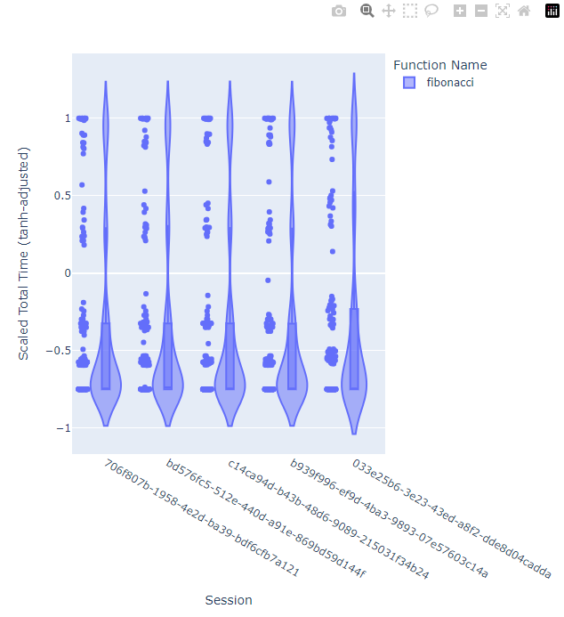

# Performance Monitor

Herramienta para monitorear métricas de ejecución.

## Descripción

Este proyecto es una herramienta para monitorear métricas de ejecución en aplicaciones Python. Permite visualizar la estructura de directorios excluyendo ciertas carpetas y proporciona funcionalidades adicionales para el monitoreo de rendimiento.

## Instalación

Puedes instalar el paquete directamente desde PyPI usando pip:
```sh
pip install -i https://test.pypi.org/simple/ performance-monitor-jesjack
```

## Uso
* ```@timeit```
```python
from performance_monitor_jesjack import timeit
@timeit
def my_function():
    # Simulación de una función que toma tiempo en ejecutarse
    import time
    time.sleep(2)
    return "Función completada"
result = my_function()
print(result)
```
El decorador `@timeit` mide el tiempo de ejecución de la función `my_function` y lo guarda en una base de datos local.

* ```@timeit.show```
```python
from performance_monitor_jesjack import timeit
@timeit.show
def my_function():
    # Simulación de una función que toma tiempo en ejecutarse
    import time
    time.sleep(2)
    return "Función completada"
result = my_function()
print(result)
```
El decorador `@timeit.show` mide el tiempo de ejecución de la función `my_function` y muestra el resultado en un gráfico como este:


* ```show_graph()```
```python
from performance_monitor_jesjack import show_graph
show_graph()
```
El método `show_graph()` muestra un gráfico de barras con los tiempos de ejecución de las funciones monitoreadas.

* ```show_graph.on_exit()```
```python
from performance_monitor_jesjack import show_graph
show_graph.on_exit()
```
El método `show_graph.on_exit()` muestra un gráfico de barras con los tiempos de ejecución de las funciones monitoreadas al salir del programa.

## Contribución
1. Haz un fork del repositorio.
2. Crea una nueva rama (`git checkout -b feature/nueva-caracteristica`).
3. Realiza tus cambios y haz commit (`git commit -m 'Añadir nueva característica'`).
4. Haz push a la rama (`git push origin feature/nueva-caracteristica`).
5. Crea un Pull Request.

## Licencia
Este proyecto está bajo la Licencia MIT. Consulta el archivo [LICENSE](LICENSE) para más detalles.

## Contacto
* Author: jesjack.
* Email: jesjack25_03@hotmail.com
* Github: [jesjack](https://github.com/jesjack)